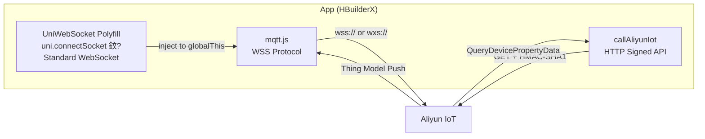

# Silkworm Smart Farming IoT System

> 铓曞吇娈栨櫤鑳界洃鎺х郴缁?鈥?ESP32-S3 杈圭紭缃戝叧 路 K230 AI 瑙嗚璇嗗埆 路 璺ㄥ钩鍙?App

绔埌绔墿鑱旂綉鏅鸿兘铓曞吇娈栬В鍐虫柟妗堬紝闆?*杈圭紭 AI 鎺ㄧ悊銆佸浼犳劅鍣ㄧ幆澧冪洃娴嬨€佽嚜鍔ㄧ幆澧冭皟鎺с€佷簯绔仴娴嬨€佺Щ鍔ㄧ App 鎺у埗**浜庝竴浣撱€備笓涓哄皬瑙勬ā铓曞吇娈栨埛璁捐锛屼綆鎴愭湰銆侀珮闆嗘垚搴︺€佸彲绂荤嚎杩愯銆?
---

## System Architecture


---

## Project Structure

```
silkworm/
鈹溾攢鈹€ ai/                              # 馃 YOLO Silkworm Detection Training
鈹?  鈹溾攢鈹€ train.py                     #    Training script (custom hyperparams)
鈹?  鈹溾攢鈹€ ce.py                        #    Validation evaluation
鈹?  鈹溾攢鈹€ export_onnx.py               #    ONNX export 鈫?K230 deployment
鈹?  鈹溾攢鈹€ visualize_samples.py         #    Dataset visualization
鈹?  鈹溾攢鈹€ yolo11n.pt                   #    Pretrained weights (gitignored)
鈹?  鈹溾攢鈹€ yolo26n.pt                   #    Pretrained weights (gitignored)
鈹?  鈹斺攢鈹€ datasets/                    #    Training dataset (gitignored)
鈹?      鈹溾攢鈹€ data.yaml                #    Dataset config (2 classes)
鈹?      鈹溾攢鈹€ train/                   #    Train set (images + labels)
鈹?      鈹斺攢鈹€ val/                     #    Val set (images + labels)
鈹?鈹溾攢鈹€ esp32/                           # 馃敡 ESP32-S3 Firmware (MicroPython)
鈹?  鈹溾攢鈹€ main.py                      #    Main program (1s control loop)
鈹?  鈹溾攢鈹€ K230/                        #    K230 AI vision firmware
鈹?  鈹?  鈹溾攢鈹€ main.py                  #        YOLO inference + tracking + upload
鈹?  鈹?  鈹斺攢鈹€ best.kmodel              #        Compiled model (gitignored)
鈹?  鈹溾攢鈹€ smart_control.py             #    Decision engine (thresholds/mode/actuators)
鈹?  鈹溾攢鈹€ aliyun_mqtt.py               #    Aliyun MQTT (HMAC-SHA1 auth)
鈹?  鈹溾攢鈹€ wifi_conn.py                 #    WiFi manager (exponential backoff)
鈹?  鈹溾攢鈹€ system_guardian.py           #    Watchdog + GC + runtime monitor
鈹?  鈹溾攢鈹€ voice_alert.py               #    ASR Pro voice alert (UART sharing)
鈹?  鈹溾攢鈹€ dht_reader.py                #    DHT22 temp/humidity driver
鈹?  鈹溾攢鈹€ bh1750_reader.py             #    BH1750 light sensor driver
鈹?  鈹溾攢鈹€ mq137_reader.py              #    MQ137 ammonia driver
鈹?  鈹溾攢鈹€ co2_reader.py                #    MH-Z19 CO2 driver
鈹?  鈹溾攢鈹€ soil_reader.py               #    Soil moisture driver
鈹?  鈹溾攢鈹€ gps_reader.py                #    GPS (NMEA + 30s cache)
鈹?  鈹溾攢鈹€ ir_reader.py                 #    IR intrusion detection
鈹?  鈹溾攢鈹€ k230_reader.py               #    K230 serial data reader
鈹?  鈹溾攢鈹€ actuator_controller.py       #    Actuator GPIO abstraction
鈹?  鈹溾攢鈹€ boot.py                      #    Startup script
鈹?  鈹溾攢鈹€ REPL.py                      #    Debug REPL
鈹?  鈹斺攢鈹€ docs/                        #    Architecture docs & flowcharts
鈹?鈹斺攢鈹€ miniprogram/                     # 馃摫 HBuilderX + uni-app (Vue3 + TypeScript)
    鈹溾攢鈹€ src/
    鈹?  鈹溾攢鈹€ api/aliyun.ts            #    Aliyun IoT HTTP API wrapper
    鈹?  鈹溾攢鈹€ utils/ws-polyfill.ts     #    馃攽 WebSocket Polyfill adapter
    鈹?  鈹溾攢鈹€ store/
    鈹?  鈹?  鈹溾攢鈹€ device.ts            #    Reactive state management
    鈹?  鈹?  鈹斺攢鈹€ lang.ts              #    i18n (Chinese/English)
    鈹?  鈹溾攢鈹€ pages/
    鈹?  鈹?  鈹溾攢鈹€ dashboard/index.vue  #    Overview (6 sensor cards)
    鈹?  鈹?  鈹溾攢鈹€ control/index.vue    #    Controls (actuators + mode)
    鈹?  鈹?  鈹溾攢鈹€ alarm/index.vue      #    Alarm center (intrusion/sick/env)
    鈹?  鈹?  鈹溾攢鈹€ history/index.vue    #    History charts (1h/6h/24h/7d)
    鈹?  鈹?  鈹斺攢鈹€ sick-history/        #    Sick silkworm history
    鈹?  鈹溾攢鈹€ components/
    鈹?  鈹?  鈹溾攢鈹€ SensorCard.vue       #    Liquid Glass sensor card
    鈹?  鈹?  鈹溾攢鈹€ LineChart.vue        #    Trend line chart
    鈹?  鈹?  鈹溾攢鈹€ AlertPopup.vue       #    Global alert popup
    鈹?  鈹?  鈹溾攢鈹€ SickAlertCard.vue    #    Sick alert card
    鈹?  鈹?  鈹溾攢鈹€ Cube3D.vue           #    3D decoration
    鈹?  鈹?  鈹斺攢鈹€ NeonToggle3D.vue     #    Neon toggle switch
    鈹?  鈹溾攢鈹€ static/                  #    Icon resources
    鈹?  鈹溾攢鈹€ manifest.json            #    uni-app config
    鈹?  鈹溾攢鈹€ pages.json               #    Route config
    鈹?  鈹斺攢鈹€ uni.scss                 #    Global styles
    鈹溾攢鈹€ docs/                        #    Design docs & specs
    鈹溾攢鈹€ index.html
    鈹溾攢鈹€ vite.config.ts
    鈹溾攢鈹€ tsconfig.json
    鈹斺攢鈹€ package.json
```

---

## Three Subsystems in Detail

### 馃 AI Model Training (`ai/`)

**Pain Point:** Traditional silkworm farming relies on manual visual inspection for sick silkworms 鈥?inefficient, subjective, and unsustainable.

Built a silkworm health detection model using **Ultralytics YOLO11n/YOLO26n**, with custom hyperparameter tuning, ONNX export, and nncase compilation for edge deployment on K230:

- **Custom loss weights:** `box=10.0`, `cls=0.8`, `dfl=2.0` 鈥?improve box precision and healthy/sick classification
- **Data augmentation:** `mixup=0.2`, `copy_paste=0.3`, `mosaic=1.0` 鈥?combat small dataset overfitting
- **Optimizer:** `AdamW`, `lr0=0.001`
- **Deployment pipeline:** `YOLO training 鈫?.pt 鈫?ONNX (opset=11, simplify) 鈫?.kmodel (nncase) 鈫?K230`

```
Training pipeline:
  Dataset(data.yaml: 2 classes: healthy, unhealthy)
  鈫?YOLO.train(epochs=100, imgsz=640, batch=8)
  鈫?best.pt 鈫?export_onnx.py 鈫?best.onnx
  鈫?nncase compile 鈫?best.kmodel 鈫?SD card 鈫?K230
```

---

### 馃敡 ESP32-S3 Edge Gateway (`esp32/`)

**Pain Point:** 24/7 multi-dimensional monitoring + AI vision + automatic control. PLCs are too expensive, single-sensor solutions are inadequate.

#### K230 AI Vision Inference (Edge Deployment)

K230 is a RISC-V AI chip running YOLO models **locally without cloud connectivity**:

```
Camera 1080P frame 鈫?letterbox preprocess 鈫?YOLO inference
鈫?NMS dedup (0.4 IoU) 鈫?object tracking (Euclidean < 120px)
鈫?sleep detection (50 frames stationary)
鈫?sick silkworm capture (160脳120) 鈫?Base64 鈫?ImgBB upload
鈫?URL sent back to ESP32 via UART
```

Key optimizations:
- **Dual camera channels:** Ch2 (1080P) for AI inference, Ch1 (160脳120) for capture upload 鈥?dramatically reduces memory usage
- **Per-frame GC:** `gc.collect()` at loop start prevents memory fragmentation
- **ImgBB cooldown:** 60s cooldown between sick uploads to avoid API rate limits
- **Serial data protocol:** `DATA:T%d,H%d,U%d,S%d|URL:%s\n`

#### Multi-Agent Cascade

```
Every 1 second main loop:
  Guardian.feed()
  鈫?WiFiManager.ensure() 鈫?MQTTManager.ensure() 鈫?MQTTManager.check_msg()
  鈫?read_k230() + read_dht22() + read_bh1750() + read_mq137() + read_soil() + read_ir()
  鈫?SmartController.update(sensors + AI data)
  鈫?voice_alert.check_and_alert()
  鈫?CO2/GPS slow read (30s cache)
  鈫?Build thing model packet 鈫?MQTT publish
  鈫?Guardian.GC() 鈫?sleep(calibrated to 1s)
```

#### SmartController Decision Logic

| Mode | Condition | Action |
|---|---|---|
| **Temperature** | `temp > TEMP_HIGH(30C)` | Fan ON, Heater OFF |
| | `temp < TEMP_LOW(15C)` | Fan OFF, Heater ON |
| **Humidity** | `hum < HUM_LOW(40%)` | Atomizer ON |
| | `hum > HUM_HIGH(80%)` | Atomizer OFF |
| **Light** | `lux < LUX_LOW(1 Lux)` | RGB Light ON |
| | `lux > LUX_HIGH(550 Lux)` | RGB Light OFF |
| **Alert** | `ir=1(Intrusion) or AI sick>0` | Alert LED ON + Voice |

Thresholds are **remotely adjustable** via the App 鈥?ESP32 auto-syncs.

#### Communication Reliability

- **MQTT exponential backoff:** `wait = 1 脳 2^attempt`, max 5 retries
- **WiFi auto-reconnect:** Connection check every 5s, auto-reconnect on failure
- **UART time-sharing:** CO2, GPS, VoiceAlert share UART1 via temporary instances
- **Manual action cooldown:** 2s grace period after user operation to prevent conflicts
- **Hardware watchdog:** 300s timeout, auto-reboot on hang

---

### 馃摫 HBuilderX + uni-app App (`miniprogram/`)

**Pain Point:** Farmers need real-time monitoring, alerts, and remote control anytime, anywhere. Maintaining separate Android/iOS/mini-program codebases is too costly.

Built with **HBuilderX + uni-app (Vue3 + TypeScript)** 鈥?one codebase compiling to Android, iOS, H5, and WeChat Mini Program. The core communication layer uses a **WebSocket Polyfill** to adapt uni-app's native environment.

#### Communication Architecture



**UniWebSocket Polyfill 鈥?Key Engineering Decision:**

mqtt.js v4.x requires browser-native `WebSocket`, but uni-app's native App environment doesn't have it. Instead of replacing the MQTT library, a **WebSocket adapter layer** was created:

```typescript
class UniWebSocket implements WebSocket {
    // Wraps uni.connectSocket as standard WebSocket interface
    // Implements: onopen, onmessage, onerror, onclose, send(), close()
    // readyState constants, binaryType, bufferedAmount, etc.
}
// Injected into globalThis for mqtt.js seamless operation
(globalThis as any).WebSocket = UniWebSocket;
```

This allows mqtt.js's full feature set (auto-reconnect, keepalive, QoS) to work out of the box without rewriting MQTT logic.

#### App Pages

| Page | Features |
|---|---|
| **Dashboard** | 6 sensor real-time cards (Temp/Hum/CO2/Light/NH3/Soil) + ESP32 status + theme switcher |
| **Controls** | Actuator toggles (Fan/Heater/Atomizer/RGB/Alert) + Auto/Manual mode + Remote threshold config |
| **Alarm Center** | Intrusion detection + Sick alert + Environment alert log + Today's alert stats |
| **History** | 1h/6h/24h/7d trend charts + Cloud history incremental sync + Trend analysis |
| **Sick History** | Sick silkworm capture gallery + Cumulative sick count + Local image cache |

#### Alert Engine (Multi-level State Machine)

```
Sensor data stream 鈫?Threshold comparison 鈫?State change detection:
  trigger:      normal 鈫?abnormal (immediate alert + vibrate + popup)
  persistent:   abnormal for >=10min (secondary reminder)
  recovery:     abnormal 鈫?normal (clear anomaly flag)

Cooldown: 2 min per metric+direction pair (anti-spam)
Popup behavior: mild alerts auto-close in 5s, severe alerts require manual dismiss
```

#### Control Lock Mechanism

```
User operates actuator 鈫?controlLocks[key] = current timestamp
MQTT cloud message arrives 鈫?check lock 鈫?< 2.5s skip this field
鈫?Precise conflict prevention, avoiding cloud stale state overriding real-time operations
```

#### Data Sync

- **Real-time channel:** WebSocket MQTT subscribe to `/${pk}/${dn}/user/get`, receive device push
- **History channel:** HTTP API query `QueryDevicePropertyData`, incremental pull (initial 12h, then incremental)
- **Local persistence:** `uni.setStorageSync` cache for history, alerts, sick image records

#### App Experience Features

- **Liquid Glass UI:** `backdrop-filter: blur(20px)` frosted glass + micro-interactions
- **4 gradient themes:** Macaron/Mint/Sunset/Aurora, animated color interpolation
- **i18n:** One-click Chinese/English toggle, full-page real-time response
- **Sick image management:** Auto-download 鈫?local cache 鈫?thumbnail list 鈫?delete/clear

---

## Data Flow Overview

```
Sensors 鈫?ESP32 GPIO(1s cycle) 鈹€鈹?K230 AI 鈫?UART Serial(1s cycle) 鈹€鈹尖攢鈫?SmartController(threshold decision)
Cloud cmds 鈫?MQTT callback 鈹€鈹€鈹€鈹€鈹€鈹€鈹€鈹?       鈹?                                            鈹溾攢鈫?GPIO Actuators (fan/heater/atomizer/light)
                                            鈹溾攢鈫?UART Voice (ASR Pro)
                                            鈹斺攢鈫?MQTT Publish (Aliyun Thing Model)
                                                        鈹?                                               鈹屸攢鈹€鈹€鈹€鈹€鈹€鈹€鈻尖攢鈹€鈹€鈹€鈹€鈹€鈹€鈹€鈹?                                               鈹? Aliyun IoT    鈹?                                               鈹? MQTT Broker   鈹?                                               鈹? + TimeSeries  鈹?                                               鈹斺攢鈹€鈹€鈹€鈹€鈹€鈹€鈹攢鈹€鈹€鈹€鈹€鈹€鈹€鈹€鈹?                                                        鈹?                                               鈹屸攢鈹€鈹€鈹€鈹€鈹€鈹€鈻尖攢鈹€鈹€鈹€鈹€鈹€鈹€鈹€鈹?                                               鈹?App (uni-app)   鈹?                                               鈹?Real-time MQTT  鈹?                                               鈹?HTTP History    鈹?                                               鈹?UI + Alerts     鈹?                                               鈹斺攢鈹€鈹€鈹€鈹€鈹€鈹€鈹€鈹€鈹€鈹€鈹€鈹€鈹€鈹€鈹€鈹?```

---

## Tech Stack

| Layer | Technology | Purpose |
|---|---|---|
| **AI Training** | Ultralytics YOLO11n/YOLO26n, PyTorch | Silkworm health detection |
| **Model Export** | ONNX (opset=11), nncase | Edge deployment |
| **AI Inference** | K230 (Kendryte RISC-V), nncase_runtime | Real-time YOLO inference |
| **Embedded** | ESP32-S3, MicroPython | Edge gateway |
| **Sensors** | DHT22, BH1750, MQ137, MH-Z19, Soil Moisture, GPS, IR | Environmental monitoring |
| **Actuators** | Relays (Fan/Heater/Atomizer), RGB LED, Buzzer | Environmental control |
| **Voice** | ASR Pro (UART serial protocol) | Voice alerts |
| **Cloud** | Aliyun IoT (MQTT + HTTP API) | Device connectivity & telemetry |
| **App Framework** | HBuilderX + uni-app (Vue3 + TypeScript) | Cross-platform mobile |
| **Communication** | MQTT over WebSocket, HMAC-SHA1 signing | Real-time bidirectional |
| **UI** | Liquid Glass (frosted glass), gradient themes | User interface |

---

## Quick Deployment

### 1. ESP32 Firmware

```bash
# 1. Upload all .py files from esp32/ to ESP32 filesystem
# 2. Modify configuration in main.py:
```

```python
# esp32/main.py
SSID = "YOUR_WIFI_SSID"
PASSWORD = "YOUR_WIFI_PASSWORD"
PRODUCT_KEY = 'your_product_key'
DEVICE_NAME = 'your_device_name'
DEVICE_SECRET = 'your_device_secret'
```

### 2. K230 Module

```bash
# 1. Copy best.kmodel to K230 SD card /sdcard/
# 2. Upload K230/main.py to K230
# 3. Configure WIFI_SSID / WIFI_PASS / IMG_BB_KEY
```

### 3. Aliyun IoT Setup

1. Create IoT product, define thing model (properties: temperature, humidity, CO2, NH3, lux, soilHumidity, Silkworm_Total, etc.)
2. Register device, get ProductKey / DeviceName / DeviceSecret
3. Configure MQTT parameters on device side

### 4. App

```bash
# Open miniprogram/ with HBuilderX
# Edit src/store/device.ts with your Aliyun config
# Run to Android/iOS device or WeChat Mini Program
```

---

## Notes

- This repo has sensitive credentials replaced with placeholders; **local files retain real values**
- `ai/datasets/` is the training dataset, not version-controlled
- `*.pt`, `*.kmodel` are model weight files, gitignored due to size
- K230 firmware requires separate flashing via serial or SD card
- Aliyun IoT requires a paid or trial account with devices configured

---

## License

MIT License 鈥?for reference and learning only
