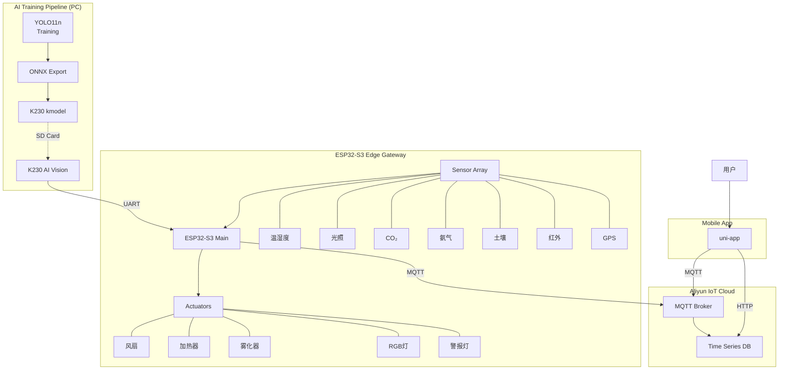
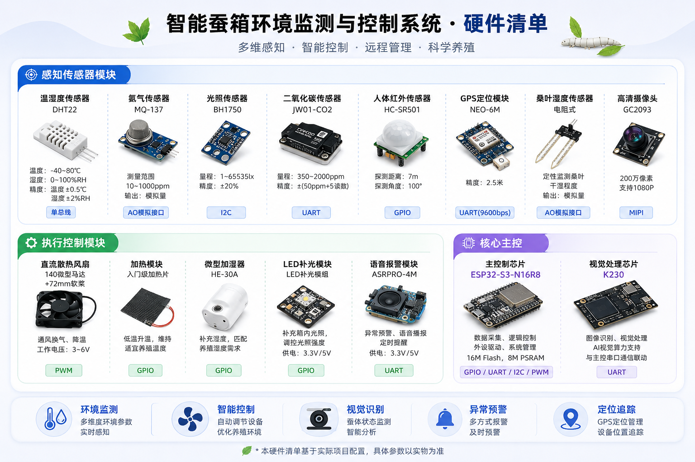
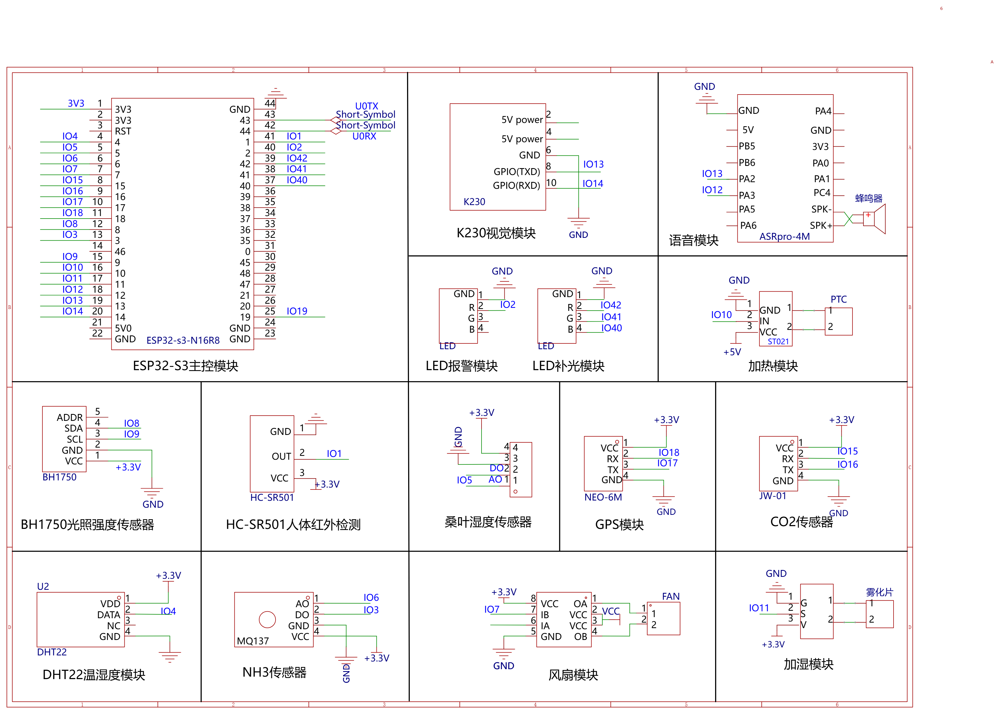

# 蚕养殖智能监控系统

> Silkworm Smart Farming IoT System

[](https://github.com/ireneadler258-create/silkworm)
[](LICENSE)

**端到端物联网智能蚕养殖解决方案**，集边缘 AI 推理、多传感器环境监测、自动环境调控、云端遥测、跨平台 App 控制于一体。

---

## ✨ 核心功能

### 🤖 AI 智能识别
- **YOLO 病蚕检测**：实时识别健康/病蚕/眠期状态
- **K230 边缘推理**：本地 AI 处理，低延迟高可靠
- **病蚕图片上传**：自动捕获并上传至云端存档

### 📊 环境监测（7 类传感器）
| 传感器 | 功能 | 接口 |
|--------|------|------|
| DHT22 | 温度 + 湿度 | GPIO |
| BH1750 | 光照强度 | I2C |
| MH-Z19B | CO₂ 浓度 | UART |
| MQ137 | 氨气 (NH₃) | ADC |
| 土壤湿度 | 桑叶湿度 | ADC |
| 红外 | 入侵检测 | GPIO |
| GPS | 定位信息 | UART |

### ⚡ 智能控制（5 类执行器）
| 执行器 | 功能 | 控制方式 |
|--------|------|----------|
| 风扇 | 降温通风 | 继电器 |
| 加热器 | 升温保暖 | 继电器 |
| 雾化器 | 加湿调节 | 继电器 |
| RGB 灯 | 补光照明 | GPIO |
| 警报灯 | 异常报警 | GPIO |

### 🔄 双模式控制
- **自动模式**：根据传感器数据 + 阈值自动控制
- **手动模式**：通过 App 远程控制执行器
- **动态阈值**：支持 App 实时调整阈值参数

### 📱 跨平台 App (uni-app)
- **多端支持**：H5 / 微信小程序 / Android / iOS / 鸿蒙
- **实时监控**：传感器数据实时展示
- **历史趋势**：折线图分析环境变化
- **告警推送**：异常状态即时通知
- **多语言**：支持中文/英文切换
- **多主题**：5 种背景主题可选

### 🛡️ 系统稳定性
- **硬件看门狗**：5 分钟超时自动重启
- **WiFi 自动重连**：断线自动恢复
- **MQTT 自动重连**：指数退避重试
- **内存管理**：定期 GC 回收

---

## 🏗️ 系统架构



---

## 📦 项目结构

```
silkworm/
├── ai/                              # 🧠 AI 模型训练
│   ├── train.py                     #    训练脚本
│   ├── export_onnx.py               #    ONNX 导出
│   ├── convert_to_kmodel.py         #    K230 模型转换
│   └── datasets/                    #    数据集 (gitignored)
│
├── esp32/                           # 🔧 ESP32 固件
│   ├── main.py                      #    主程序
│   ├── smart_control.py             #    智能控制逻辑
│   ├── aliyun_mqtt.py              #    MQTT 通信
│   ├── config.example.py            #    配置模板
│   ├── K230/                        #    K230 AI 代码
│   └── docs/                        #    文档
│
├── miniprogram/                     # 📱 跨平台 App (uni-app)
│   ├── src/
│   │   ├── pages/                   #    页面
│   │   ├── store/                   #    状态管理
│   │   ├── components/              #    组件
│   │   ├── locales/                 #    国际化
│   │   └── config/                  #    配置模板
│   └── package.json
│
└── docs/                            # 📄 文档资源
    └── images/                      #    图片资源
```

---

## 🔌 硬件接线

### 硬件清单



### 接线图



---

## 🛠️ 技术栈

### AI 训练
| 技术 | 版本 | 用途 |
|------|------|------|
| Python | 3.10+ | 运行环境 |
| Ultralytics YOLO | 8.x | 目标检测框架 |
| nncase | 1.x | K230 模型转换 |
| ONNX | 1.14+ | 模型格式 |

### ESP32 固件
| 技术 | 版本 | 用途 |
|------|------|------|
| MicroPython | 1.20+ | 运行环境 |
| ESP32-S3 | - | 主控制器 |
| K230 | - | AI 视觉模块 |

### 微信小程序
| 技术 | 版本 | 用途 |
|------|------|------|
| Vue | 3.4+ | 前端框架 |
| uni-app | 3.0 | 跨平台框架 |
| Pinia | 3.0+ | 状态管理 |
| vue-i18n | 9.x | 国际化 |
| MQTT.js | 4.x | MQTT 客户端 |
| uCharts | 2.5+ | 图表组件 |

### 云服务
| 服务 | 用途 |
|------|------|
| 阿里云 IoT | 设备接入、数据存储 |
| ImgBB | 病蚕图片托管 |

---

## 🚀 快速开始

### 1. AI 模型训练

```bash
cd ai/
pip install ultralytics

# 训练模型
python train.py

# 导出 ONNX
python export_onnx.py

# 转换为 K230 模型
python convert_to_kmodel.py --model path/to/best.onnx
```

### 2. ESP32 固件部署

```bash
# 1. 刷入 MicroPython 固件
# 2. 复制 esp32/ 文件到开发板
# 3. 创建配置文件
cp esp32/config.example.py esp32/config.py
# 编辑 config.py 填入实际配置

# 4. 复制 K230/ 和 best.kmodel 到 SD 卡
```

### 3. 微信小程序

```bash
cd miniprogram/
npm install

# 创建配置文件
cp src/config/device.example.ts src/store/device.ts
cp src/config/aliyun.example.ts src/api/aliyun.ts
# 编辑配置文件填入实际凭证

# 使用 HBuilderX 运行到微信开发者工具
```

---

## ⚙️ 配置说明

### ESP32 配置

```python
# esp32/config.py
WIFI_SSID = "your_wifi_ssid"
WIFI_PASSWORD = "your_wifi_password"

PRODUCT_KEY = 'your_product_key'
DEVICE_NAME = 'your_device_name'
DEVICE_SECRET = 'your_device_secret'
```

### 小程序配置

```typescript
// miniprogram/src/store/device.ts
const options = {
    productKey: 'your_product_key',
    deviceName: 'your_device_name',
    deviceSecret: 'your_device_secret',
    // ...
};
```

---

## 📸 系统截图

> 待补充 App 界面截图

---

## 🔒 安全说明

- **敏感信息**：所有配置文件已加入 `.gitignore`
- **配置模板**：使用 `.example` 文件分享配置结构
- **生产环境**：建议使用环境变量或密钥管理服务

---

## 📝 版本历史

| 版本 | 日期 | 更新内容 |
|------|------|----------|
| v1.0.0 | 2026-06-23 | 初始版本，整合所有子项目 |

---

## 📄 许可证

MIT License - 仅供学习参考

---

## 👥 贡献者

- [ireneadler258-create](https://github.com/ireneadler258-create)
