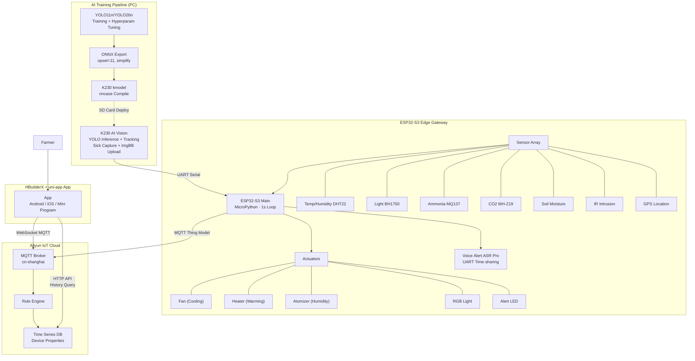

# Silkworm Smart Farming IoT System

> 蚕养殖智能监控系统 — ESP32-S3 边缘网关 · K230 AI 视觉识别 · 跨平台 App

端到端物联网智能蚕养殖解决方案，集**边缘 AI 推理、多传感器环境监测、自动环境调控、云端遥测、移动端 App 控制**于一体。专为小规模蚕养殖户设计，低成本、高集成度、可离线运行。

---

## System Architecture



---

## Project Structure

```
silkworm/
├── ai/                              # 🧠 YOLO Silkworm Detection Training
│   ├── train.py                     #    Training script (custom hyperparams)
│   ├── ce.py                        #    Validation evaluation
│   ├── export_onnx.py               #    ONNX export -> K230 deployment
│   ├── convert_to_kmodel.py         #    ONNX to K230 kmodel conversion
│   ├── visualize_samples.py         #    Dataset visualization
│   ├── yolo11n.pt                   #    Pretrained weights (gitignored)
│   ├── yolo26n.pt                   #    Pretrained weights (gitignored)
│   └── datasets/                    #    Training dataset (gitignored)
│       ├── data.yaml                #    Dataset config (2 classes)
│       ├── train/                   #    Train set (images + labels)
│       └── val/                     #    Val set (images + labels)
│
├── esp32/                           # 🔧 ESP32-S3 Firmware (MicroPython)
│   ├── main.py                      #    Main loop: sensor read → control → MQTT report
│   ├── wifi_conn.py                 #    WiFi connect + auto-reconnect
│   ├── aliyun_mqtt.py              #    Aliyun MQTT: HMAC-SHA1 auth, auto-reconnect
│   ├── smart_control.py            #    Dual-mode control logic (Manual/Auto)
│   ├── actuator_controller.py       #    Fan/Heater/Atomizer/LED relay driver
│   ├── dht_reader.py                #    DHT22 temperature + humidity
│   ├── bh1750_reader.py             #    BH1750 I2C light sensor
│   ├── mq137_reader.py              #    MQ137 ammonia (NH3) ADC
│   ├── co2_reader.py                #    MH-Z19B CO2 UART
│   ├── soil_reader.py               #    Soil moisture ADC
│   ├── gps_reader.py                #    GPS UART NMEA parser (cached)
│   ├── ir_reader.py                 #    IR intrusion digital input
│   ├── k230_reader.py               #    K230 UART data + sick image URL
│   ├── voice_alert.py               #    ASR Pro voice alert via UART
│   ├── system_guardian.py           #    Hardware WDT + memory watchdog
│   ├── config.example.py            #    Config template (copy to config.py)
│   ├── K230/                        #    K230 AI Vision board
│   │   ├── main.py                  #      YOLO inference + tracking + ImgBB upload
│   │   └── best.kmodel             #      Trained kmodel (gitignored)
│   └── docs/                        #    Documentation
│
├── miniprogram/                     # 📱 uni-app WeChat Miniprogram
│   ├── src/
│   │   ├── pages/                   #    Page components
│   │   │   ├── dashboard/           #      Overview: sensor grid + device status
│   │   │   ├── control/             #      Controls: manual/auto mode + threshold
│   │   │   ├── history/             #      History: line charts + trend analysis
│   │   │   ├── alarm/               #      Logs: intrusion + silkworm alerts
│   │   │   └── sick-history/        #      Sick silkworm detection history
│   │   ├── store/device.ts          #      Pinia store: MQTT + sensors + controls
│   │   ├── api/aliyun.ts            #      Aliyun IoT OpenAPI wrapper
│   │   ├── components/              #      Reusable components
│   │   ├── locales/                 #      i18n (zh-CN, en)
│   │   ├── config/                  #      Config templates
│   │   │   ├── device.example.ts    #        Device config template
│   │   │   └── aliyun.example.ts    #        API config template
│   │   └── static/                  #      Icons and images
│   ├── package.json                 #    Dependencies
│   └── vite.config.ts              #    Vite config
│
└── README.md                        #    This file
```

---

## Quick Start

### 1. AI Model Training (PC)

```bash
cd ai/
pip install ultralytics

# Train
python train.py

# Export ONNX
python export_onnx.py

# Convert to K230 kmodel (requires nncase)
python convert_to_kmodel.py --model path/to/best.onnx
```

### 2. ESP32-S3 Firmware

1. Flash MicroPython to ESP32-S3
2. Copy `esp32/` files to board
3. Create config file:
   ```bash
   cp config.example.py config.py
   # Edit config.py with your WiFi and Aliyun credentials
   ```
4. Copy `K230/` files + `best.kmodel` to K230 SD card

### 3. WeChat Miniprogram

1. Install dependencies:
   ```bash
   cd miniprogram/
   npm install
   ```

2. Create config files:
   ```bash
   cp src/config/device.example.ts src/store/device.ts
   cp src/config/aliyun.example.ts src/api/aliyun.ts
   # Edit both files with your Aliyun credentials
   ```

3. Open in HBuilderX, run to WeChat DevTools

---

## Configuration Setup

### ESP32 Configuration

1. Copy the config template:
   ```bash
   cp esp32/config.example.py esp32/config.py
   ```

2. Edit `esp32/config.py` with your actual credentials:
   - WiFi SSID and password
   - Aliyun IoT device credentials (ProductKey, DeviceName, DeviceSecret)

### Miniprogram Configuration

1. Copy the device config template:
   ```bash
   cp miniprogram/src/config/device.example.ts miniprogram/src/store/device.ts
   ```

2. Copy the API config template:
   ```bash
   cp miniprogram/src/config/aliyun.example.ts miniprogram/src/api/aliyun.ts
   ```

3. Edit both files with your actual Aliyun credentials.

### AI Model Configuration

No configuration file needed. Update the model path directly in:
- `ai/export_onnx.py` - Update the path to your trained model

---

## Security Notes

- **Never commit real credentials** to version control
- All config files with real credentials are gitignored
- Use the `.example` templates to share configuration structure
- Store production credentials in environment variables or secure vaults

---

## License

MIT License — for reference and learning only
