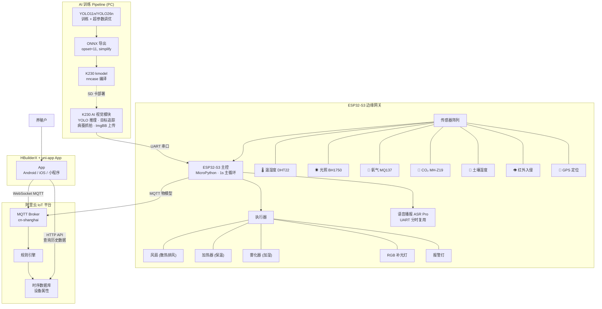
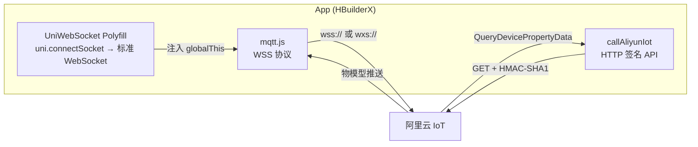

# Silkworm Smart Farming IoT System

> 蚕养殖智能监控系统 — ESP32-S3 边缘网关 · K230 AI 视觉识别 · 跨平台 App

一个端到端的物联网智能蚕养殖解决方案，集 **边缘 AI 推理、多传感器环境监测、自动环境调控、云端遥测、移动端 App 控制** 于一体。专为小规模蚕养殖户设计，低成本、高集成度、可离线运行。

---

## 系统架构全景



---

## 项目结构

```
silkworm/
├── ai/                              # 🧠 YOLO 蚕体检测模型训练
│   ├── train.py                     #    训练脚本 (自定义超参数)
│   ├── ce.py                        #    验证评估
│   ├── export_onnx.py               #    ONNX 导出 → K230 部署
│   ├── visualize_samples.py         #    数据集可视化
│   ├── yolo11n.pt                   #    预训练权重 (已 gitignore)
│   ├── yolo26n.pt                   #    预训练权重 (已 gitignore)
│   └── datasets/                    #    训练数据集 (已 gitignore)
│       ├── data.yaml                #    数据集配置 (2 类: healthy/unhealthy)
│       ├── train/                   #    训练集 (images + labels)
│       └── val/                     #    验证集 (images + labels)
│
├── esp32/                           # 🔧 ESP32-S3 固件 (MicroPython)
│   ├── main.py                      #    主程序 (1 秒控制循环)
│   ├── K230/                        #    K230 AI 视觉模块固件
│   │   ├── main.py                  #        YOLO 推理 + 目标追踪 + 抓拍上传
│   │   └── best.kmodel              #        编译后的模型 (已 gitignore)
│   ├── smart_control.py             #    智能决策引擎 (阈值/模式/执行器)
│   ├── aliyun_mqtt.py               #    阿里云 MQTT (HMAC-SHA1 认证)
│   ├── wifi_conn.py                 #    WiFi 管理器 (指数退避重连)
│   ├── system_guardian.py           #    看门狗 + GC + 运行监控
│   ├── voice_alert.py               #    ASR Pro 语音报警 (UART 分时)
│   ├── dht_reader.py                #    DHT22 温湿度驱动
│   ├── bh1750_reader.py             #    BH1750 光照驱动
│   ├── mq137_reader.py              #    MQ137 氨气驱动
│   ├── co2_reader.py                #    MH-Z19 CO₂驱动
│   ├── soil_reader.py               #    土壤湿度传感器驱动
│   ├── gps_reader.py                #    GPS (NMEA 解析 + 30s 缓存)
│   ├── ir_reader.py                 #    红外入侵检测
│   ├── k230_reader.py               #    K230 串口数据读取
│   ├── actuator_controller.py       #    执行器 GPIO 抽象
│   ├── boot.py                      #    启动脚本
│   ├── REPL.py                      #    调试 REPL
│   └── docs/                        #    架构文档与流程图
│
└── miniprogram/                     # 📱 HBuilderX + uni-app (Vue3 + TypeScript)
    ├── src/
    │   ├── api/aliyun.ts            #    阿里云 IoT HTTP API 封装
    │   ├── utils/ws-polyfill.ts     #    🔑 WebSocket Polyfill 适配层
    │   ├── store/
    │   │   ├── device.ts            #    响应式状态管理中心
    │   │   └── lang.ts              #    国际化 (中/英)
    │   ├── pages/
    │   │   ├── dashboard/index.vue  #    总览页 (6 传感器卡片)
    │   │   ├── control/index.vue    #    控制页 (执行器 + 模式切换)
    │   │   ├── alarm/index.vue      #    报警中心 (入侵/病蚕/环境告警)
    │   │   ├── history/index.vue    #    历史数据趋势图 (1h/6h/24h/7d)
    │   │   └── sick-history/        #    病蚕检测历史记录
    │   ├── components/
    │   │   ├── SensorCard.vue       #    Liquid Glass 传感器卡片
    │   │   ├── LineChart.vue        #    趋势折线图
    │   │   ├── AlertPopup.vue       #    全局告警弹窗
    │   │   ├── SickAlertCard.vue    #    病蚕告警卡片
    │   │   ├── Cube3D.vue           #    3D 装饰组件
    │   │   └── NeonToggle3D.vue     #    Neon 开关组件
    │   ├── static/                  #    图标资源
    │   ├── manifest.json            #    uni-app 配置文件
    │   ├── pages.json               #    路由配置
    │   └── uni.scss                 #    全局样式变量
    ├── docs/                        #    设计文档与规格
    ├── index.html
    ├── vite.config.ts
    ├── tsconfig.json
    └── package.json
```

---

## 三大子系统详解

### 🧠 AI 模型训练 (`ai/`)

**痛点：** 传统蚕养殖依赖人工肉眼巡检病蚕，效率低、主观性强、无法持续。

利用 **Ultralytics YOLO11n** 构建蚕体健康检测模型，经过超参数调优、ONNX 导出、nncase 编译三步部署到 K230 边缘芯片：

- **自定义损失权重：** `box=10.0`, `cls=0.8`, `dfl=2.0` — 提升检测框精度与健康/病蚕分类能力
- **数据增强策略：** `mixup=0.2`, `copy_paste=0.3`, `mosaic=1.0` — 解决小样本过拟合
- **优化器：** `AdamW`, `lr0=0.001`
- **部署链路：** `YOLO 训练 → .pt → ONNX (opset=11, simplify) → .kmodel (nncase) → K230`

```
训练链路:
  数据集(data.yaml: 2 classes) → YOLO.train(epochs=100, imgsz=640, batch=8)
  → best.pt → export_onnx.py → best.onnx → nncase 编译 → best.kmodel → SD 卡 → K230
```

---

### 🔧 ESP32-S3 边缘网关 (`esp32/`)

**痛点：** 7×24 小时多维度监控 + AI 视觉 + 自动调控，传统 PLC 成本高、单传感器方案功能单一。

#### K230 AI 视觉推理 (边缘部署)

K230 是一颗 RISC-V AI 芯片，本地运行 YOLO 模型，**无需联网即可实时检测**：

```
摄像头 1080P 帧 → letterbox 预处理 → YOLO 推理 → NMS 去重(0.4 IoU)
→ 目标追踪(欧氏距离 < 120px 匹配) → 静止计数(50 帧=睡眠)
→ 病蚕检测 → 抓拍(160×120) → Base64 → ImgBB 上传 → URL 串口回传 ESP32
```

关键优化：
- **双通道摄像头：** 通道 2 (1080P) 用于 AI 识别，通道 1 (160×120) 用于抓拍上传，大幅降低内存占用
- **逐帧 GC：** 每循环开始处 `gc.collect()`，防止内存碎片
- **ImgBB 冷却：** 60 秒内重复病蚕不重复上传，避免 API 限流
- **串口数据帧协议：** `DATA:T%d,H%d,U%d,S%d|URL:%s\n`

#### 多 Agent 级联协作

```
每 1 秒主循环:
  Guardian.喂狗()
  → WiFiManager.保活() → MQTTManager.保活() → MQTTManager.检查指令()
  → read_k230() + read_dht22() + read_bh1750() + read_mq137() + read_soil() + read_ir()
  → SmartController.update(传感器 + AI 数据)
  → voice_alert.check_and_alert()
  → CO2/GPS 慢速读取(30s 缓存)
  → 构建物模型数据包 → MQTT 发布
  → Guardian.GC() →  sleep(校准到 1s)
```

#### 智能决策引擎 (`SmartController`)

| 模式 | 条件 | 动作 |
|---|---|---|
| **温度控制** | `temp > TEMP_HIGH(30℃)` | 风扇开，加热器关 |
| | `temp < TEMP_LOW(15℃)` | 风扇关，加热器开 |
| **湿度控制** | `hum < HUM_LOW(40%)` | 雾化器开 |
| | `hum > HUM_HIGH(80%)` | 雾化器关 |
| **补光控制** | `lux < LUX_LOW(1 Lux)` | RGB 灯开 |
| | `lux > LUX_HIGH(550 Lux)` | RGB 灯关 |
| **报警控制** | `ir=1(入侵) 或 AI 病蚕>0` | 报警灯开 + 语音播报 |

阈值可通过 App **远程动态调整**，调整后 ESP32 自动同步。

#### 通信可靠性

- **MQTT 指数退避重连：** `wait = 1 × 2^attempt`，最长 5 次尝试
- **WiFi 自动保活：** 每 5 秒检查连接状态，断开自动重连
- **UART 分时复用：** CO₂、GPS、VoiceAlert 共享 UART1，通过临时创建/销毁实例避免冲突
- **手动操作避让：** 用户操作后 2 秒内跳过自动控制，防止争抢
- **硬件看门狗：** 300 秒超时，死机自动重启

---

### 📱 HBuilderX + uni-app App (`miniprogram/`)

**痛点：** 养殖户需要随时查看状态、接收告警、远程控制。App 需同时支持 Android、iOS、小程序，三套原生代码维护成本过高。

采用 **HBuilderX + uni-app (Vue3 + TypeScript)**，一套代码同时编译到 Android、iOS、H5 和微信小程序。核心通信层通过 **WebSocket Polyfill** 适配 uni-app 原生环境。

#### 通信架构



**UniWebSocket Polyfill — 关键工程决策：**

mqtt.js v4.x 依赖浏览器原生 `WebSocket`，但 uni-app 原生 App 没有此全局对象。方案不是替换 mqtt 库，而是创建**适配层**：

```typescript
class UniWebSocket implements WebSocket {
    // 包装 uni.connectSocket → 标准 WebSocket 接口
    // 实现: onopen, onmessage, onerror, onclose, send(), close()
    // readyState 常量, binaryType, bufferedAmount 等
}
// 注入到 globalThis，让 mqtt.js 无感知运行
(globalThis as any).WebSocket = UniWebSocket;
```

#### App 功能模块

| 页面 | 功能 |
|---|---|
| **总览** (Dashboard) | 6 传感器实时数据卡片 (温/湿/CO₂/光照/NH₃/土壤湿度) + ESP32 在线状态 + 背景主题切换 |
| **控制** (Control) | 执行器开关 (风扇/加热/雾化/RGB灯/报警灯) + 自动/手动模式切换 + 阈值远程设置 |
| **报警中心** (Alarm) | 入侵检测 + 病蚕告警 + 环境告警记录 + 今日告警统计 |
| **历史数据** (History) | 1h/6h/24h/7d 趋势折线图 + 云端历史增量同步 + 趋势分析 |
| **病蚕历史** (Sick History) | 病蚕抓拍图片列表 + 累计病蚕数 + 本地图片缓存 |

#### 告警引擎 (多级状态机)

```
传感器数据流 → 阈值比较 → 状态变更检测:
  trigger:      正常 → 异常 (立即告警 + 振动 + 弹窗)
  persistent:   异常持续 ≥10 分钟 (二次提醒)
  recovery:     异常 → 正常 (清除异常标记)

冷却规则: 2 分钟/相同指标+方向，防止刷屏
弹窗行为: 轻微告警 5s 自动关闭，严重告警需手动确认
```

#### 控制锁机制

```
用户操作执行器 → controlLocks[key] = 当前时间戳
MQTT 云端消息到达 → 检查 lock → < 2.5s 跳过该字段
→ 精确防冲突，避免云端旧状态覆盖实时操作
```

#### 数据同步

- **实时通道：** WebSocket MQTT 订阅 `/${pk}/${dn}/user/get`，接收设备推送
- **历史通道：** HTTP API 查询 `QueryDevicePropertyData`，增量拉取 (首次 12h，之后增量)
- **本地持久化：** `uni.setStorageSync` 缓存历史数据、告警事件、病蚕图片记录

#### App 体验特性

- **Liquid Glass UI：** `backdrop-filter: blur(20px)` 毛玻璃效果 + 微交互动画
- **4 套渐变主题：** 马卡龙/薄荷/日落/极光，SVG 颜色插值
- **中英文国际化：** 一键切换，全页面实时响应
- **病蚕图片管理：** 自动下载 → 本地缓存 → 缩略图列表 → 删除/清空

---

## 数据流全景

```
传感器 → ESP32 GPIO(1秒周期) ─┐
K230 AI → UART 串口(1秒周期) ─┼─→ SmartController(阈值决策)
云指令 → MQTT 订阅回调 ────────┘        │
                                         ├─→ GPIO 执行器 (风扇/加热/雾化/灯光)
                                         ├─→ UART 语音 (ASR Pro)
                                         └─→ MQTT 发布 (阿里云物模型)
                                                      │
                                              ┌───────▼────────┐
                                              │   阿里云 IoT    │
                                              │  MQTT Broker   │
                                              │  + 时序数据库   │
                                              └───────┬────────┘
                                                      │
                                              ┌───────▼────────┐
                                              │ App (uni-app)   │
                                              │ 实时 MQTT 订阅  │
                                              │ HTTP 历史查询   │
                                              │ UI 渲染 + 告警  │
                                              └────────────────┘
```

---

## 技术栈

| 层级 | 技术 | 用途 |
|---|---|---|
| **AI 训练** | Ultralytics YOLO11n/YOLO26n, PyTorch | 蚕体健康检测模型 |
| **模型导出** | ONNX (opset=11), nncase | 边缘端推理部署 |
| **AI 推理** | K230 (Kendryte RISC-V), nncase_runtime | 实时视频流 YOLO 推理 |
| **嵌入式** | ESP32-S3, MicroPython | 边缘网关主控 |
| **传感器** | DHT22, BH1750, MQ137, MH-Z19, 土壤湿度, GPS, 红外 | 环境监测 |
| **执行器** | 继电器 (风扇/加热器/雾化器), RGB LED, 蜂鸣器 | 环境调控 |
| **语音** | ASR Pro (UART 串口协议) | 语音报警 |
| **云平台** | 阿里云 IoT (MQTT + HTTP API) | 设备接入与遥测 |
| **App 框架** | HBuilderX + uni-app (Vue3 + TypeScript) | 跨平台移动端 |
| **通信** | MQTT over WebSocket, HMAC-SHA1 签名 | 实时双向通信 |
| **UI** | Liquid Glass (毛玻璃), 渐变主题 | 用户界面 |

---

## 快速部署

### 1. ESP32 固件

```bash
# 1. 将 esp32/ 目录下所有 .py 文件上传到 ESP32 文件系统
# 2. 修改 main.py 中的配置:
```

```python
# esp32/main.py
SSID = "你的WiFi名称"
PASSWORD = "你的WiFi密码"
PRODUCT_KEY = '你的阿里云产品Key'
DEVICE_NAME = '你的设备名称'
DEVICE_SECRET = '你的设备密钥'
```

### 2. K230 模块

```bash
# 1. 将 best.kmodel 放入 K230 SD 卡 /sdcard/ 目录
# 2. 将 K230/main.py 上传到 K230
# 3. 修改 WIFI_SSID / WIFI_PASS / IMG_BB_KEY
```

### 3. 阿里云 IoT 配置

1. 创建物联网平台产品，定义物模型 (属性: temperature, humidity, CO₂, NH₃, lux, soilHumidity, Silkworm_Total 等)
2. 注册设备，获取 ProductKey / DeviceName / DeviceSecret
3. 配置设备端 MQTT 参数

### 4. App

```bash
# 使用 HBuilderX 打开 miniprogram/ 目录
# 修改 src/store/device.ts 中的阿里云配置
# 运行到 Android/iOS 真机或微信小程序
```

---

## 注意事项

- 本仓库上传时已替换敏感凭据为占位符，**本地文件另保留真实值**
- `ai/datasets/` 为训练数据集，未纳入版本控制
- `*.pt`, `*.kmodel` 为模型权重文件，体积较大已 gitignore
- K230 固件需要单独通过串口或 SD 卡烧录
- 阿里云 IoT 需购买或开通免费试用，配置设备后才可通信

---

## License

MIT License — 仅供学习和参考
