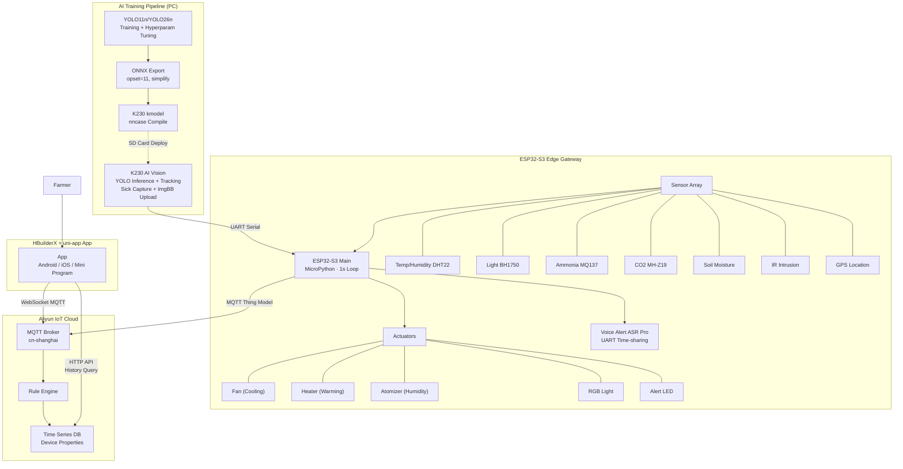

# Silkworm Smart Farming IoT System

> 蚕养殖智能监控系统 — ESP32-S3 边缘网关 · K230 AI 视觉识别 · 跨平台 App

端到端物联网智能蚕养殖解决方案，集**边缘 AI 推理、多传感器环境监测、自动环境调控、云端遥测、移动端 App 控制**于一体。专为小规模蚕养殖户设计，低成本、高集成度、可离线运行。

---

## System Architecture



---

## Project Structure

```
silkworm/
├── ai/                              # 🧠 YOLO Silkworm Detection Training
│   ├── train.py                     #    Training script (custom hyperparams)
│   ├── ce.py                        #    Validation evaluation
│   ├── export_onnx.py               #    ONNX export -> K230 deployment
│   ├── visualize_samples.py         #    Dataset visualization
│   ├── yolo11n.pt                   #    Pretrained weights (gitignored)
│   ├── yolo26n.pt                   #    Pretrained weights (gitignored)
│   └── datasets/                    #    Training dataset (gitignored)
│       ├── data.yaml                #    Dataset config (2 classes)
│       ├── train/                   #    Train set (images + labels)
│       └── val/                     #    Val set (images + labels)
│
├── esp32/                           # 🔧 ESP32-S3 Firmware (MicroPython)
│   ├── main.py                      #    Main program (1s control loop)
│   ├── K230/                        #    K230 AI vision firmware
│   │   ├── main.py                  #        YOLO inference + tracking + upload
│   │   └── best.kmodel              #        Compiled model (gitignored)
│   ├── smart_control.py             #    Decision engine (thresholds/mode/actuators)
│   ├── aliyun_mqtt.py               #    Aliyun MQTT (HMAC-SHA1 auth)
│   ├── wifi_conn.py                 #    WiFi manager (exponential backoff)
│   ├── system_guardian.py           #    Watchdog + GC + runtime monitor
│   ├── voice_alert.py               #    ASR Pro voice alert (UART sharing)
│   ├── dht_reader.py                #    DHT22 temp/humidity driver
│   ├── bh1750_reader.py             #    BH1750 light sensor driver
│   ├── mq137_reader.py              #    MQ137 ammonia driver
│   ├── co2_reader.py                #    MH-Z19 CO2 driver
│   ├── soil_reader.py               #    Soil moisture driver
│   ├── gps_reader.py                #    GPS (NMEA + 30s cache)
│   ├── ir_reader.py                 #    IR intrusion detection
│   ├── k230_reader.py               #    K230 serial data reader
│   ├── actuator_controller.py       #    Actuator GPIO abstraction
│   ├── boot.py                      #    Startup script
│   ├── REPL.py                      #    Debug REPL
│   └── docs/                        #    Architecture docs & flowcharts
│
└── miniprogram/                     # 📱 HBuilderX + uni-app (Vue3 + TypeScript)
    ├── src/
    │   ├── api/aliyun.ts            #    Aliyun IoT HTTP API wrapper
    │   ├── utils/ws-polyfill.ts     #    🔑 WebSocket Polyfill adapter
    │   ├── store/
    │   │   ├── device.ts            #    Reactive state management
    │   │   └── lang.ts              #    i18n (Chinese/English)
    │   ├── pages/
    │   │   ├── dashboard/index.vue  #    Overview (6 sensor cards)
    │   │   ├── control/index.vue    #    Controls (actuators + mode)
    │   │   ├── alarm/index.vue      #    Alarm center (intrusion/sick/env)
    │   │   ├── history/index.vue    #    History charts (1h/6h/24h/7d)
    │   │   └── sick-history/        #    Sick silkworm history
    │   ├── components/
    │   │   ├── SensorCard.vue       #    Liquid Glass sensor card
    │   │   ├── LineChart.vue        #    Trend line chart
    │   │   ├── AlertPopup.vue       #    Global alert popup
    │   │   ├── SickAlertCard.vue    #    Sick alert card
    │   │   ├── Cube3D.vue           #    3D decoration
    │   │   └── NeonToggle3D.vue     #    Neon toggle switch
    │   ├── static/                  #    Icon resources
    │   ├── manifest.json            #    uni-app config
    │   ├── pages.json               #    Route config
    │   └── uni.scss                 #    Global styles
    ├── docs/                        #    Design docs & specs
    ├── index.html
    ├── vite.config.ts
    ├── tsconfig.json
    └── package.json
```

---

## Three Subsystems

### AI Model Training (ai/)

**Pain Point:** Traditional silkworm farming relies on manual visual inspection for sick silkworms — inefficient, subjective, and unsustainable.

Built a silkworm health detection model using **Ultralytics YOLO11n/YOLO26n**, with custom hyperparameter tuning, ONNX export, and nncase compilation for edge deployment on K230:

- **Custom loss weights:** box=10.0, cls=0.8, dfl=2.0 — improve box precision and healthy/sick classification
- **Data augmentation:** mixup=0.2, copy_paste=0.3, mosaic=1.0 — combat small dataset overfitting
- **Optimizer:** AdamW, lr0=0.001
- **Deployment pipeline:** YOLO training -> .pt -> ONNX (opset=11, simplify) -> .kmodel (nncase) -> K230

### ESP32-S3 Edge Gateway (esp32/)

**Pain Point:** 24/7 multi-dimensional monitoring + AI vision + automatic control. PLCs are too expensive, single-sensor solutions are inadequate.

**K230 AI Vision Inference:** K230 is a RISC-V AI chip running YOLO models locally without cloud connectivity. It performs real-time 1080P inference with object tracking, sleep detection, and sick silkworm capture upload to ImgBB.

Key optimizations:
- **Dual camera channels:** Ch2 (1080P) for AI, Ch1 (160x120) for capture — reduces memory usage
- **Per-frame GC:** gc.collect() at loop start prevents memory fragmentation
- **ImgBB cooldown:** 60s between sick uploads to avoid API rate limits
- **Serial protocol:** DATA:T%d,H%d,U%d,S%d|URL:%s\n

**SmartController Decision Logic:**

| Mode | Condition | Action |
|---|---|---|
| Temperature | temp > TEMP_HIGH(30C) | Fan ON, Heater OFF |
| Temperature | temp < TEMP_LOW(15C) | Fan OFF, Heater ON |
| Humidity | hum < HUM_LOW(40%) | Atomizer ON |
| Humidity | hum > HUM_HIGH(80%) | Atomizer OFF |
| Light | lux < LUX_LOW(1 Lux) | RGB ON |
| Light | lux > LUX_HIGH(550 Lux) | RGB OFF |
| Alert | ir=1 or AI sick>0 | Alert LED + Voice |

Thresholds are remotely adjustable via the App — ESP32 auto-syncs.

### HBuilderX + uni-app App (miniprogram/)

**Pain Point:** Farmers need real-time monitoring, alerts, and remote control anytime, anywhere. Maintaining separate Android/iOS/mini-program codebases is too costly.

Built with **HBuilderX + uni-app (Vue3 + TypeScript)** — one codebase compiling to Android, iOS, H5, and WeChat Mini Program. The core communication layer uses a **WebSocket Polyfill** to adapt uni-app's native environment.

**UniWebSocket Polyfill:** mqtt.js v4.x requires browser-native WebSocket, but uni-app's native App environment doesn't have it. Instead of replacing the MQTT library, a WebSocket adapter layer was created, wrapping uni.connectSocket as standard WebSocket interface and injecting into globalThis.

**App Pages:**
- Dashboard: 6 sensor real-time cards + ESP32 status + theme switcher
- Controls: Actuator toggles + Auto/Manual mode + Remote threshold config
- Alarm Center: Intrusion detection + Sick alert + Environment alert log
- History: 1h/6h/24h/7d trend charts + Cloud history sync + Trend analysis
- Sick History: Sick silkworm capture gallery + Cumulative sick count

**Alert Engine:** Multi-level state machine with trigger/persistent/recovery states, 2-min cooldown per metric, auto-close mild alerts in 5s, manual dismiss for severe alerts.

**Control Lock:** Timestamp-based conflict prevention — 2.5s grace period when user operates actuator before accepting cloud updates.

**Data Sync:**
- Real-time: WebSocket MQTT subscribe
- History: HTTP API incremental pull (initial 12h, then delta)
- Local: uni.setStorageSync for offline cache

---

## Data Flow

```
Sensors -> ESP32 GPIO(1s cycle)
K230 AI -> UART Serial(1s cycle)
        -> SmartController(threshold decision)
            -> GPIO Actuators
            -> UART Voice (ASR Pro)
            -> MQTT Publish (Aliyun Thing Model)
                -> Aliyun IoT Cloud
                    -> App (Real-time MQTT + HTTP History)
                    -> Farmer
```

---

## Tech Stack

| Layer | Technology | Purpose |
|---|---|---|
| AI Training | Ultralytics YOLO11n/YOLO26n, PyTorch | Silkworm health detection |
| Model Export | ONNX (opset=11), nncase | Edge deployment |
| AI Inference | K230 (Kendryte RISC-V), nncase_runtime | Real-time YOLO inference |
| Embedded | ESP32-S3, MicroPython | Edge gateway |
| Sensors | DHT22, BH1750, MQ137, MH-Z19, Soil, GPS, IR | Environmental monitoring |
| Actuators | Relays, RGB LED, Buzzer | Environmental control |
| Voice | ASR Pro (UART protocol) | Voice alerts |
| Cloud | Aliyun IoT (MQTT + HTTP API) | Device connectivity |
| App | HBuilderX + uni-app (Vue3 + TypeScript) | Cross-platform mobile |
| Communication | MQTT over WebSocket, HMAC-SHA1 | Real-time bidirectional |
| UI | Liquid Glass, gradient themes | User interface |

---

## Quick Deployment

### 1. ESP32 Firmware

Upload all .py files from esp32/ to ESP32 filesystem. Modify in main.py:

```python
SSID = "YOUR_WIFI_SSID"
PASSWORD = "YOUR_WIFI_PASSWORD"
PRODUCT_KEY = 'your_product_key'
DEVICE_NAME = 'your_device_name'
DEVICE_SECRET = 'your_device_secret'
```

### 2. K230 Module

Copy best.kmodel to K230 SD card /sdcard/. Upload K230/main.py. Configure WIFI_SSID/WIFI_PASS/IMG_BB_KEY.

### 3. Aliyun IoT Setup

Create IoT product, define thing model (temperature, humidity, CO2, NH3, lux, soilHumidity, Silkworm_Total...). Register device, get ProductKey/DeviceName/DeviceSecret.

### 4. App

Open miniprogram/ with HBuilderX. Edit src/store/device.ts with your Aliyun config. Run to Android/iOS or WeChat Mini Program.

---

## Notes

- This repo has sensitive credentials replaced with placeholders; local files retain real values
- ai/datasets/ is the training dataset, not version-controlled
- *.pt, *.kmodel are model weight files, gitignored due to size
- K230 requires separate flashing via serial or SD card
- Aliyun IoT requires a paid or trial account

---

## License

MIT License — for reference and learning only