# ESP32-S3 主程序流程图 (Mermaid)

```mermaid
flowchart TB
    %% 样式定义
    classDef startend fill:#e1f5fe,stroke:#01579b,stroke-width:2px,font-size:14px
    classDef process fill:#fff3e0,stroke:#e65100,stroke-width:1px,font-size:13px
    classDef decision fill:#e8f5e9,stroke:#1b5e20,stroke-width:1px,font-size:13px
    classDef io fill:#fce4ec,stroke:#880e4f,stroke-width:1px,font-size:13px
    classDef subproc fill:#f3e5f5,stroke:#4a148c,stroke-width:1px,font-size:12px
    
    subgraph INIT["初始化阶段"]
        direction TB
        START(["系统上电"]):::startend
        --> DELAY["延时等待<br/>STARTUP_DELAY=5秒"]:::process
        --> GUARDIAN["初始化看门狗<br/>Guardian(timeout=300s)"]:::process
        --> WIFI["初始化WiFi<br/>WiFiManager连接"]:::io
        --> MQTT_INIT["初始化MQTT<br/>MQTTManager连接"]:::io
        --> ACTUATORS["初始化执行器<br/>风扇/加热器/雾化器<br/>报警灯/RGB灯"]:::process
        --> SENSORS["初始化传感器引脚<br/>IR传感器"]:::process
        --> BRAIN["创建智能控制器<br/>SmartController"]:::process
        --> VOICE["初始化语音报警<br/>VoiceAlert"]:::process
        --> PRINT_INIT["打印启动信息"]:::io
    end
    
    subgraph MAIN_LOOP["主循环阶段"]
        direction TB
        LOOP_START(("循环开始")):::startend
        --> FEED["喂狗<br/>guardian.feed()"]:::process
        --> CHECK_WIFI["WiFi连接检查<br/>ensure_connected()"]:::decision
        --> CHECK_CONN{"连接OK?"}:::decision
        -->|否| SKIP_MQTT1["跳过MQTT处理"]:::process
        -->|是| CHECK_MSG["检查MQTT消息<br/>check_msg()"]:::io
        -->|是| MSG_OK{"有消息?"}:::decision
        -->|否| READ_SENSOR["读取快速传感器"]:::process
        -->|是| MQ_CB["MQTT回调处理<br/>解析指令<br/>handle_command"]:::subproc
        --> MQ_CB --> RET_STATUS["回发状态<br/>publish"]:::io
        --> READ_SENSOR
        --> SMARTS["智能控制决策<br/>brain.update()"]:::subproc
        --> GET_STATUS["获取设备状态<br/>get_all_status()"]:::process
        --> PRINT_LOG["打印状态日志"]:::io
        --> VOICE_ALERT["语音报警检查<br/>check_and_alert()"]:::subproc
        --> TIME_CHECK["时间检查<br/>上报间隔判断"]:::decision
        --> SHOULD_REPORT{"满足上报<br/>条件?"}:::decision
        -->|否| SLEEP["休眠计算<br/>sleep_time"]:::process
        -->|是| READ_SLOW["读取慢速传感器<br/>CO2/GPS"]:::process
        --> BUILD_PKT["构建数据包"]:::process
        --> PUBLISH["发布数据<br/>publish_sensor_data"]:::io
        --> PUBLISH --> LAST_REPORT["更新上报时间"]:::process
        --> SLEEP
    end
    
    CHECK_CONN -->|否| SKIP_MQTT1
    MSG_OK -->|否| READ_SENSOR
    
    subgraph MQTT_CB_DETAIL["MQTT回调详细"]
        direction TB
        CB_START(("回调触发")):::startend
        --> DECODE_T["解析Topic和Msg"]:::process
        --> PARSE_JSON["JSON解析<br/>ujson.loads"]:::process
        --> GET_PARAMS["提取params"]:::process
        --> UPDATE_TIME["更新最后操作时间"]:::process
        --> CMD_TYPE{"命令类型"}:::decision
        -->|ManualMode| SET_MODE["设置模式<br/>manual_mode"]:::process
        -->|阈值| SET_THRESH["更新阈值<br/>threshold"]:::process
        -->|执行器| EXEC_CMD["执行器控制<br/>on/off"]:::process
        --> CB_END(("回调结束")):::startend
    end
    
    MQ_CB -.- MQTT_CB_DETAIL
    
    subgraph EXCEPTION["异常处理"]
        direction TB
        EXC_ENTRY{"异常捕获"}:::decision
        -->|KeyboardInterrupt| CLEANUP["清理连接<br/>disconnect"]:::process
        --> EXIT(("系统退出")):::startend
        -->|Exception| ERR_LOG["错误日志"]:::io
        --> ERR_SLEEP["延时恢复<br/>sleep(1)"]:::process
        --> ERR_SLEEP --> LOOP_START
    end
    
    FEED --> CHECK_WIFI
    
    PRINT_INIT --> LOOP_START
    
    %% 连接线说明
    subgraph KEY["图例"]
        K1[矩形: 处理]:::process
        K2{菱形: 判断}:::decision
        K3[圆角: I/O]:::io
        K4(圆形: 起止):::startend
    end
    
    %% 节点位置调整 - 使用绝对定位避免交叉
    style INIT fill:#fff8e1,stroke:#ff6f00,stroke-width:3px
    style MAIN_LOOP fill:#e8f5e9,stroke:#2e7d32,stroke-width:3px
    style MQTT_CB_DETAIL fill:#f3e5f5,stroke:#6a1b9a,stroke-width:2px
    style EXCEPTION fill:#ffebee,stroke:#c62828,stroke-width:2px
```



---

## 流程图说明

### 1. 初始化阶段 (INIT)
```
系统上电 → 延时等待(5秒) → 初始化看门狗 → WiFi连接 → MQTT连接 → 
初始化执行器 → 初始化传感器 → 创建智能控制器 → 初始化语音 → 打印启动信息
```

### 2. 主循环阶段 (MAIN_LOOP)
```
循环开始
    ↓
喂狗 (guardian.feed)
    ↓
检查WiFi连接
    ↓
[连接正常?] → 是 → 检查MQTT消息 → [有消息?] → 是 → MQTT回调处理
    ↓                                              ↓
    否                                      返回主循环
    ↓                                              ↓
读取快速传感器 (每周期执行)
    ↓
智能控制决策 (SmartController.update)
    ↓
获取设备状态
    ↓
打印日志
    ↓
语音报警检查
    ↓
时间检查 (上报间隔判断)
    ↓
[满足上报条件?] → 是 → 读取慢速传感器(CO2/GPS) → 构建数据包 → 发布数据
    ↓                                              ↓
    否                                              ↓
休眠计算 ────────────────────────────────────────────┘
    ↓
返回循环开始
```

### 3. MQTT回调处理
```
收到云端指令 → 解析JSON → 提取params → 判断命令类型
    ├── ManualMode → 设置运行模式
    ├── 阈值参数 → 更新阈值
    └── 执行器控制 → 控制执行器开关
回发当前状态 → 完成
```

### 关键参数
- STARTUP_DELAY = 5秒 (启动延迟)
- REPORT_INTERVAL = 1秒 (上报周期)
- MANUAL_ACTION_COOLDOWN = 2秒 (手动操作避让时间)
- 看门狗超时 = 300秒