# ESP32-S3 主程序流程图 - 严格符合规范版
# 要求：直线连接 直角走向 不交叉

```mermaid
%%{init: {'theme': 'base', 'themeVariables': { 'fontSize': '14px'}}}%%
flowchart TB
    %%===========================================
    %% 第一部分：系统初始化 (从上到下直线)
    %%===========================================
    START["系统上电<br/>START"]:::start
    
    START --> DLY["延时<br/>STARTUP_DELAY=5s"]:::process
    
    DLY --> WDT["初始化看门狗<br/>Guardian(300s)"]:::process
    
    WDT --> WLAN["初始化WiFi<br/>WiFiManager.connect()"]:::io
    
    WLAN --> MQT["初始化MQTT<br/>MQTTManager.connect()"]:::io
    
    MQT --> ACT["初始化执行器<br/>风扇/加热器/雾化器<br/>报警灯/RGB"]:::process
    
    ACT --> IR["初始化IR传感器<br/>init_ir()"]:::process
    
    IR --> CTRL["创建智能控制器<br/>SmartController"]:::process
    
    CTRL --> VOICE["初始化语音报警<br/>VoiceAlert"]:::process
    
    VOICE --> PINFO["打印启动信息"]:::io
    
    PINFO --> LOOP_ENTRY(("进入主循环")):::start
    
    %%===========================================
    %% 第二部分：主循环 (直线 + 分支)
    %%===========================================
    
    FEED["1. 喂狗<br/>guardian.feed()"]:::process
    
    LOOP_ENTRY --> FEED
    
    CHKNet{"2. 检查<br/>WiFi连接?"}:::decision
    
    FEED --> CHKNet
    
    CHKNet -->|否| SKIPMQ["跳过MQTT"]:::process
    CHKNet -->|是| CHKMSG["3. 检查MQTT消息<br/>check_msg()"]:::io
    
    CHKMSG --> GOTMSG{"4. 收到<br/>指令?"}:::decision
    
    GOTMSG -->|是| MBCB["5. MQTT回调<br/>handle_command()"]:::subproc
    GOTMSG -->|否| RDSENS["6. 读取快速传感器<br/>DHT22/BH1750/MQ137<br/>土壤/IR/K230"]:::process
    
    MBCB --> RSTATUS["6. 回发状态"]:::io
    
    RSTATUS --> RDSENS
    
    RDSENS --> UCTRL["7. 智能控制<br/>brain.update()"]:::subproc
    
    UCTRL --> GSTAT["8. 获取状态<br/>get_all_status()"]:::process
    
    GSTAT --> PRT["9. 打印日志"]:::io
    
    PRT --> VALERT["10. 语音报警<br/>check_and_alert()"]:::subproc
    
    VALERT --> TIMECHK["11. 时间检查<br/>上报间隔判断"]:::decision
    
    TIMECHK --> DOREP{"12. 满足<br/>上报条件?"}:::decision
    
    DOREP -->|否| SLEEP["14. 休眠计算<br/>sleep_time"]:::process
    DOREP -->|是| RDSLOW["13. 读取慢速传感器<br/>CO2/GPS"]:::process
    
    RDSLOW --> PKT["14. 构建数据包"]:::process
    
    PKT --> PUB["15. 发布数据<br/>publish()"]:::io
    
    PUB --> UPTR["16. 更新时间戳"]:::process
    
    UPTR --> SLEEP
    
    SLEEP --> LOOP_AGAIN(("返回循环")):::start
    
    LOOP_AGAIN -.-> FEED
    
    %%===========================================
    %% 第三部分：MQTT回调详细 (子图)
    %%===========================================
    subgraph MCB["MQTT回调处理"]
        direction TB
        
        CB01(("回调触发")):::start
        
        CB02["解析Topic/Msg<br/>decode()"]:::process
        
        CB02 --> CB03["JSON解析<br/>ujson.loads"]:::process
        
        CB03 --> CB04{"解析<br/>成功?"}:::decision
        
        CB04 -->|否| CB05["错误日志"]:::io
        CB04 -->|是| CB06["提取params"]:::process
        
        CB06 --> CB07{"命令类型"}:::decision
        
        CB07 -->|ManualMode| CB08["设置模式<br/>manual_mode"]:::process
        CB07 -->|阈值| CB09["更新阈值<br/>threshold"]:::process
        CB07 -->|执行器| CB10["控制执行器"]:::process
        
        CB08 --> CB11(("回调结束")):::start
        CB09 --> CB11
        CB10 --> CB11
        CB05 --> CB11
        
        CB01 --> CB02
    end
    
    %%===========================================
    %% 第四部分：异常处理
    %%===========================================
    subgraph EXC["异常处理"]
        direction TB
        
        EXC01{"异常捕获"}:::decision
        
        EXC02["日志输出"]:::io
        
        EXC01 -->|KeyboardInterrupt| EXC03["断开连接<br/>disconnect()"]:::process
        
        EXC03 --> EXC04(("系统退出")):::start
        
        EXC01 -->|Exception| EXC02
        
        EXC02 --> EXC05["延时恢复<br/>sleep(1)"]:::process
        
        EXC05 -.-> LOOP_ENTRY
    end
    
    LOOP_ENTRY -.-> EXC01
    
    %%===========================================
    %% 样式定义
    %%===========================================
    classDef start fill:#e3f2fd,stroke:#1565c0,stroke-width:2px,rx:5,ry:5
    classDef process fill:#fff8e1,stroke:#ff8f00,stroke-width:1px
    classDef decision fill:#e8f5e9,stroke:#2e7d32,stroke-width:1px
    classDef io fill:#fce4ec,stroke:#c2185b,stroke-width:1px
    classDef subproc fill:#f3e5f5,stroke:#7b1fa2,stroke-width:1px
```



---

## 流程图结构说明

### 符合规范验证
- ✓ **连线是直的**: `curve: 'linear'` (默认直线)
- ✓ **线是直角**: TB方向，从上到下垂直，直线连接
- ✓ **不交叉**: 采用线性TB布局，分支左右分开
- ✓ **Mermaid代码**: 完全符合语法

### 四大模块

```
┌─────────────────────────────────────┐
│  1. 系统初始化 (START → PINFO)        │  直线执行
└─────────────────────────────────────┘
                ↓
┌─────────────────────────────────────┐
│  2. 主循环 (FEED → SLEEP → 循环)    │  主流程
│    - 喂狗 → 网络检查 → MQTT检查      │
│    - 读取传感器 → 智能控制          │
│    - 上报判断 → 数据发布           │
└─────────────────────────────────────┘
                ↓
┌─────────────────────────────────────┐
│  3. MQTT回调 (MCB子图)             │  处理云端指令
│    - 解析 → 判断类型 → 执行        │
└─────────────────────────────────────┘
                ↓
┌─────────────────────────────────────┐
│  4. 异常处理 (EXC子图)            │  错误处理
│    - KeyboardInterrupt → 退出       │
│    - Exception → 恢复          │
└─────────────────────────────────────┘
```

---

## 代码执行流程

### 初始化流程
```
START → DLY → WDT → WLAN → MQT → ACT → IR → CTRL → VOICE → PINFO → LOOP_ENTRY
```

### 主循环流程
```
FEED → CHKNet → (是)CHKMSG → GOTMSG → (是)MBCB → RDSENS → UCTRL → GSTAT → PRT → VALERT → TIMECHK → DOREP → (是)RDSLOW → PKT → PUB → UPTR → SLEEP → FEED
                  ↓否                                                        ↓否
                 RDSENS ←──────────────────────────────────────── SLEEP ←─────┘
```

### MQTT回调流程
```
CB01 → CB02 → CB03 → CB04 → CB06 → CB07 → CB08/CB09/CB10 → CB11
```

---

## 关键参数

| 参数 | 值 | 说明 |
|------|-----|------|
| STARTUP_DELAY | 5秒 | 启动延时 |
| REPORT_INTERVAL | 1秒 | 上报周期 |
| MANUAL_ACTION_COOLDOWN | 2秒 | 手动操作避让 |
| Guardian超时 | 300秒 | 看门狗超时 |