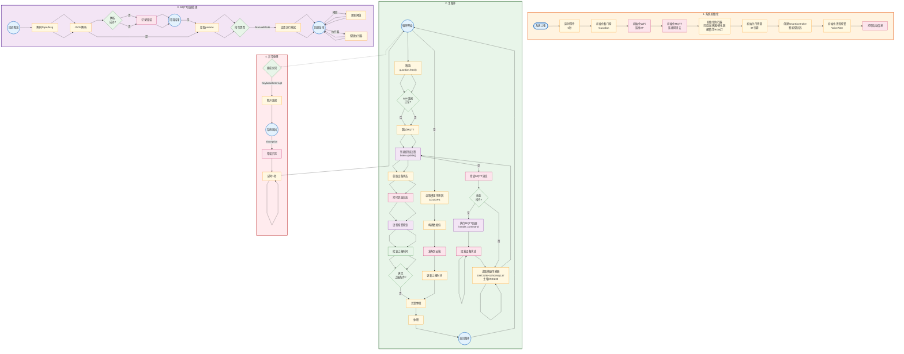

# ESP32-S3 主程序流程图 (Mermaid) - 优化版

---

## 流程说明

### 1. 系统初始化 (STARTUP)
| 步骤 | 操作 | 说明 |
|------|------|------|
| 1 | 系统上电 | ESP32启动 |
| 2 | 延时等待 | 等待5秒(STARTUP_DELAY) |
| 3 | 初始化看门狗 | Guardian, 超时300秒 |
| 4 | 初始化WiFi | 连接指定AP |
| 5 | 初始化MQTT | 连接阿里云IoT |
| 6 | 初始化执行器 | GPIO配置 |
| 7 | 初始化传感器 | 传感器引脚 |
| 8 | 创建智能控制器 | SmartController实例 |
| 9 | 初始化语音报警 | UART1 |
| 10 | 打印启动信息 | 串口输出 |

### 2. 主循环 (MAIN)
| 步骤 | 操作 | 说明 |
|------|------|------|
| 1 | 循环开始 | while True |
| 2 | 喂狗 | guardian.feed() 防重启 |
| 3 | WiFi检查 | ensure_connected() |
| 4 | MQTT消息 | check_msg() |
| 5 | MQTT回调 | 处理云端指令 |
| 6 | 读取传感器 | 快速传感器(每周期) |
| 7 | 智能控制 | brain.update() |
| 8 | 设备状态 | get_all_status() |
| 9 | 语音报警 | check_and_alert() |
| 10 | 上报判断 | REPORT_INTERVAL=1s |
| 11 | 慢速传感器 | CO2/GPS(定时) |
| 12 | 构建数据包 | JSON格式 |
| 13 | 发布数据 | publish_sensor_data() |
| 14 | 休眠计算 | 周期控制 |
| 15 | 返回循环 | 继续执行 |

### 3. MQTT回调 (CALLBACK)
| 步骤 | 操作 | 说明 |
|------|------|------|
| 1 | 回调触发 | 收到云端消息 |
| 2 | 解码 | decode topic/msg |
| 3 | JSON解析 | ujson.loads |
| 4 | 错误处理 | 异常记录 |
| 5 | 提取params | get("params") |
| 6 | 模式切换 | ManualMode |
| 7 | 阈值更新 | TempHighTh等 |
| 8 | 执行器控制 | on/off |
| 9 | 回发状态 | publish() |

### 4. 异常处理 (EXCEPT)
- KeyboardInterrupt: 用户中断 → 断开连接 → 退出
- Exception: 错误日志 → 延时恢复 → 继续循环

---

## 关键参数
- STARTUP_DELAY = 5秒
- REPORT_INTERVAL = 1秒  
- MANUAL_ACTION_COOLDOWN = 2秒
- 看门狗超时 = 300秒(5分钟)