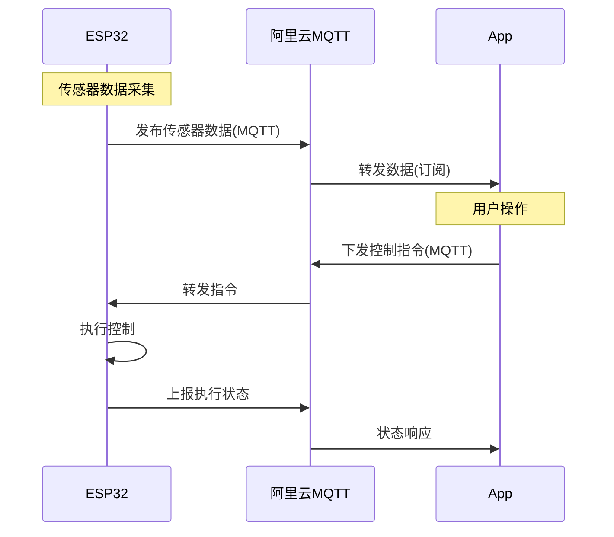
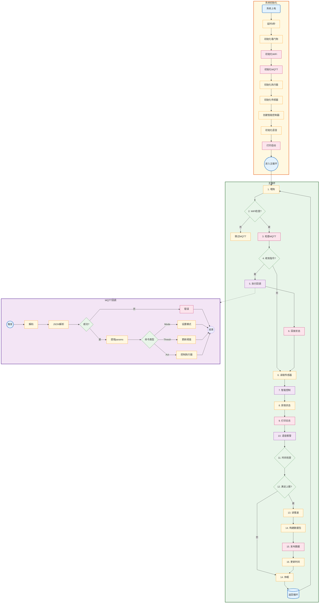
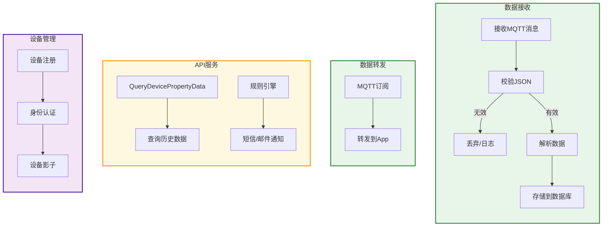
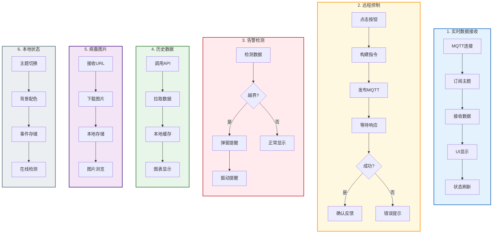
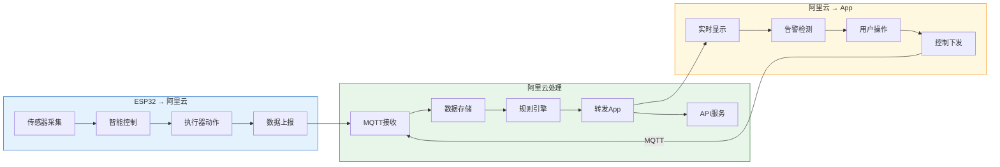

# 智慧蚕箱系统完整工作流程

---

## 系统架构总览

```mermaid
flowchart TB
    subgraph ESP["ESP32-S3 端"]
        direction TB
        ESP_START["上电初始化"] --> ESP_LOOP["主循环"]
        ESP_LOOP --> SENSOR["读取传感器"]
        SENSOR --> CONTROL["智能控制"]
        CONTROL --> ACT["执行器动作"]
        ACT --> PUBLISH["上报云端"]
        PUBLISH --> ESP_LOOP
    end
    
    subgraphALIYUN["阿里云 IoT 平台"]
        direction LR
        MQ["MQTT Broker"] <--> API["IoT API"]
        API --> DB[(数据库)]
        DB --> STORE["数据存储"]
    end
    
    subgraph APP["App 端"]
        direction TB
        APP_SUB["订阅数据"] --> APP_DISP["显示实时数据"]
        APP_DISP --> APP_CTRL["下发控制"]
        APP_CTRL --> APP_ALERT["告警检测"]
        APP_ALERT --> APP_HIST["历史数据"]
    end
    
    ESP -- MQTT --> MQ
    MQ -- MQTT --> APP
    APP -- API调用 --> API
    
    style ESP fill:#e3f2fd,stroke:#1565c0
    style ALIYUN fill:#e8f5e9,stroke:#2e7d32
    style APP fill:#fff8e1,stroke:#ff8f00
```

---

## 数据流方向



---

## 一、ESP32 端工作流程



### ESP32 功能说明

| 步骤 | 功能 | 说明 |
|------|------|------|
| 初始化 | 系统准备 | WiFi/MQTT/传感器/执行器 |
| 喂狗 | 看门狗 | 防止系统死机 |
| WiFi检查 | 网络连接 | 断线自动重连 |
| MQTT检查 | 接收指令 | 处理云端控制命令 |
| 读取传感器 | 数据采集 | 快速传感器(每周期) |
| 智能控制 | 本地决策 | 自动调节温湿度 |
| 语音报警 | 异常提醒 | 本地语音提示 |
| 上报数据 | 云端同步 | 定时推送数据 |

---

## 二、阿里云工作流程



### 阿里云功能说明

| 模块 | 功能 | 说明 |
|------|------|------|
| 数据接收 | MQTT消息解析 | 接收ESP32上报的传感器数据 |
| 数据存储 | 时序数据库 | 存储传感器历史数据 |
| 数据转发 | MQTT推送 | 将数据转发给App |
| API服务 | 接口提供 | 历史数据查询、远程控制 |
| 规则引擎 | 告警通知 | 阈值超限自动通知 |
| 设备管理 | 设备注册/认证 | 设备身份管理 |
| 设备影子 | 状态同步 | 保持设备状态一致 |

### 数据字段映射

```python
# ESP32 上报 → 阿里云存储 → App 显示
{
    "temperature": 25.5,      # 温度
    "humidity": 68.0,          # 湿度
    "CO2": 450,                # CO2浓度
    "NH3": 0.82,               # 氨气
    "lux": 320,                # 光照
    "soilHumidity": 55.0,       # 土壤湿度
    "Silkworm_Total": 1000,     # 蚕总数
    "Silkworm_Healthy": 950,    # 健康蚕
    "Silkworm_Sick": 20,       # 病蚕
    "Silkworm_Sleep": 30,      # 休眠蚕
    "GeoLocation": {...},       # GPS位置
    "fanStatus": 0,            # 风扇状态
    "heaterStatus": 0,         # 加热器状态
    "atomizerStatus": 1,        # 雾化器状态
    "lightStatus": 0,           # 灯光状态
    "ManualMode": 0              # 运行模式
}
```

---

## 三、App 工作流程



### App 功能说明

| 模块 | 功能 | 数据流 |
|------|------|--------|
| 1. 实时数据 | MQTT订阅显示 | ESP32 → 云 → App |
| 2. 远程控制 | MQTT发布 | App → 云 → ESP32 |
| 3. 告警检测 | 本地判断 | 本地处理 |
| 4. 历史数据 | API调用 | 云端API拉取 |
| 5. 病蚕图片 | URL下载 | ESP32上传 → 云 → App |
| 6. 本地状态 | 本地存储 | App本地 |

### App 界面结构

```
┌─────────────────────┐
│  智慧蚕箱 v1.0      │
├─────────────────────┤
│ [实时数据]          │
│  温度: 25.5°C     │
│  湿度: 68%         │
│  CO2: 450ppm      │
│  蚕总数: 1000     │
├─────────────────────┤
│ [控制面板]          │
│  [风扇] [加热器]   │
│  [雾化] [灯光]    │
│  [模式切换]        │
├─────────────────────┤
│ [历史] [病蚕] [设置]│
└─────────────────────┘
```

---

## 四、数据流汇总



### 完整数据链路

```
┌──────────┐    MQTT     ┌──────────┐    MQTT     ┌──────────┐
│  ESP32  │ ────────→ │  阿里云 │ ────────→ │   App   │
│        │ ←─────── │        │ ←─────── │        │
└────────┘    上报    └──────────┘    下发    └──────────┘
   ↑                              │
   │   远程控制                   │  API调用
   └──────────────────────────────┘
              响应状态
```

---

## 五、关键参数说明

| 参数 | 值 | 说明 |
|------|-----|------|
| REPORT_INTERVAL | 1秒 | ESP32上报周期 |
| STARTUP_DELAY | 5秒 | ESP32启动延时 |
| MANUAL_ACTION_COOLDOWN | 2秒 | 手动操作避让 |
| 看门狗超时 | 300秒 | 防止死机 |
| 历史数据保留 | 7天 | 云端存储周期 |